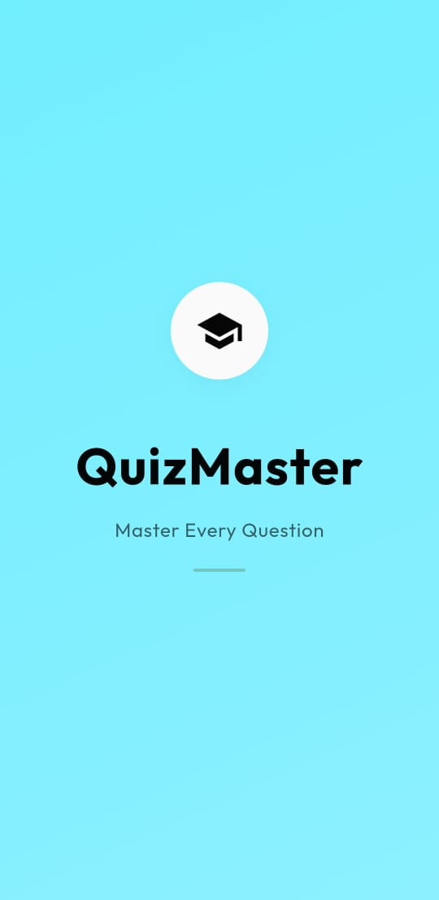
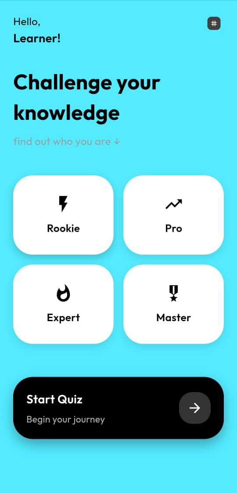
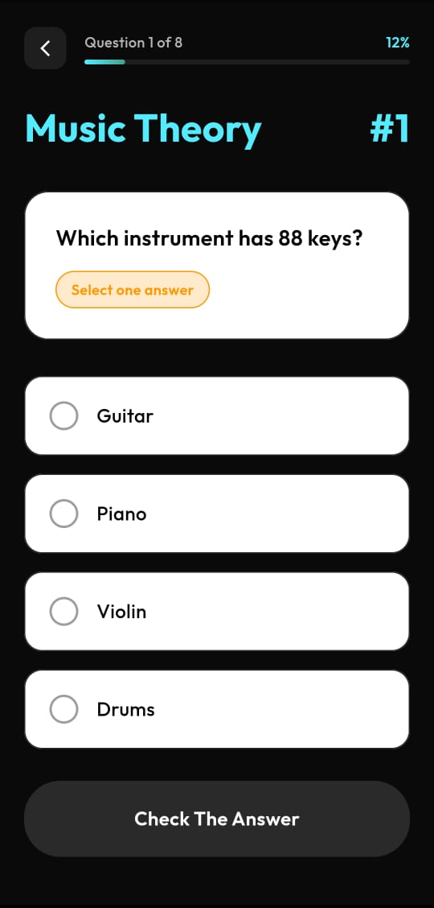
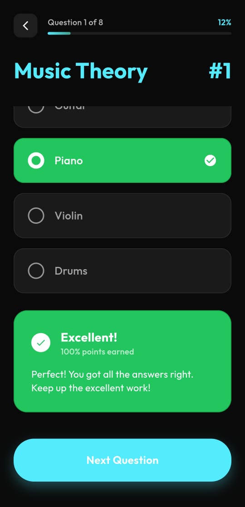
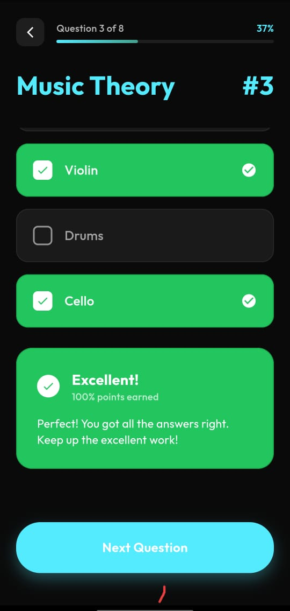
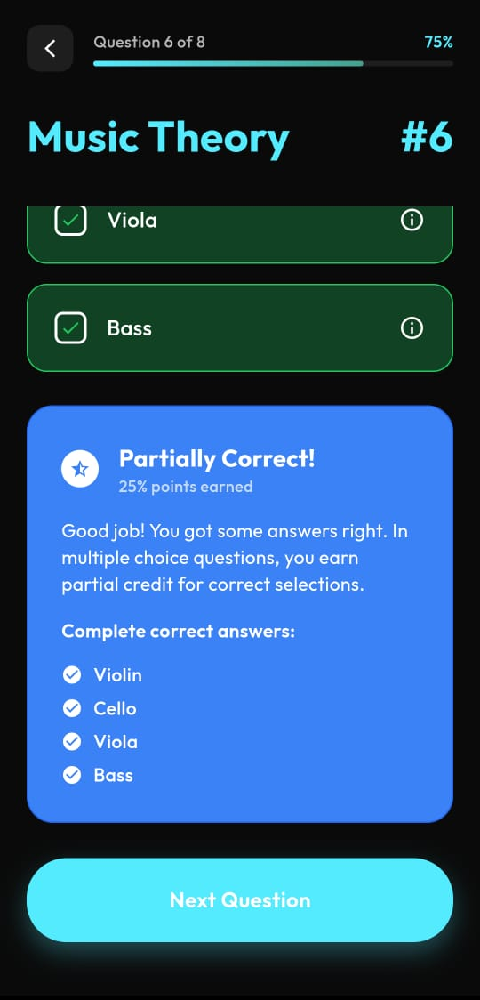
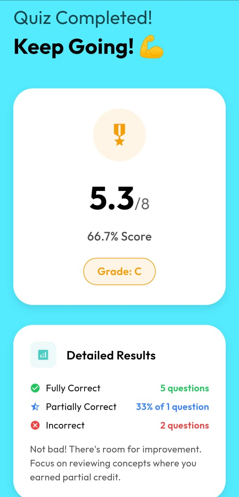

# QuizMaster 🎓

A modern Flutter quiz application that helps users discover their learning personality through interactive music theory challenges.

## ✨ Features

- **Interactive Quiz Experience**: Multiple-choice questions with immediate feedback
- **Personality Discovery**: Find out if you're an Explorer, Challenger, Perfectionist, or Strategist
- **Smooth Animations**: Beautiful splash screen with color transitions
- **Partial Scoring System**: Earn partial credit for multiple-choice questions
- **Real-time Feedback**: Instant explanations for correct and incorrect answers
- **Clean UI Design**: Modern interface with consistent color palette
- **Auto-scroll Navigation**: Seamless question-to-question transitions

## 🎯 Quiz Categories

- **Explorer**: For curious learners who like to discover
- **Challenger**: For competitive personalities  
- **Perfectionist**: For those who want to master everything
- **Strategist**: For methodical, planned learners

## 📱 Screenshots

<p float="left">
  
  
  
  
  
  
  
</p>

## 🚀 Getting Started

### Prerequisites
- Flutter SDK (latest stable version)
- Dart SDK
- Android Studio / VS Code
- Android/iOS device or emulator

### Installation

1. Clone the repository:


2. Install dependencies:
```bash
flutter pub get
```

3. Run the app:
```bash
flutter run
```

## 🏗️ Project Structure

```
lib/
├── main.dart                 # App entry point with splash screen
├── pages/
│   ├── homepage.dart         # Main dashboard
│   ├── quizpage.dart         # Quiz interface
│   └── resultpage.dart       # Results display
├── constants/
│   └── newcolor.dart         # Color palette
└── questions/
    └── questionbank.dart     # Quiz questions database
```

## 🎨 Design Features

- **Color Palette**: Smooth transitions from white to dark theme
- **Typography**: Google Fonts (Outfit) for modern appearance
- **Animations**: Fade transitions and smooth scrolling
- **Responsive**: Adapts to different screen sizes

## 🧠 Quiz Logic

- **Partial Scoring**: Earn points for partially correct answers
- **Multiple Selection**: Support for multi-answer questions
- **Immediate Feedback**: Real-time answer validation
- **Progress Tracking**: Visual progress indicators

## 🛠️ Built With

- **Flutter** - UI framework
- **Dart** - Programming language
- **Google Fonts** - Typography
- **Material Design** - Design system


